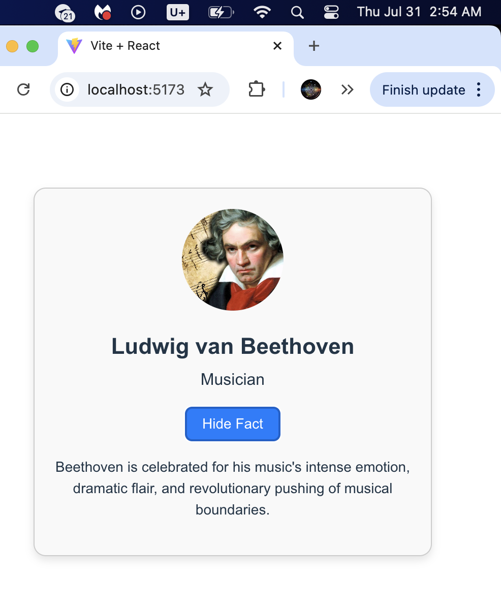

#### CS 81, by Greg H, 7/31/25
# Module 10B – Profile Component with State and Props

## Description
This project demonstrates how to use React props and state to build an interactive profile component.

## What I Learned
- How to pass props to customize a component
- How to use useState for conditional rendering
- How to design interactive interfaces in React
- How to use useState without importing the whole React library in a file
- How to use "Replace All" in VS Code

## Screenshot
(Add screenshot of your live app running with a toggled state)
